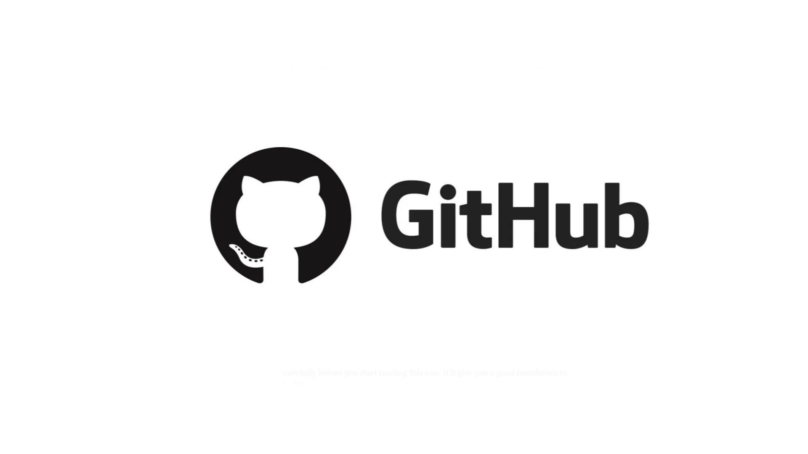

<h1 align="center"> Info Produto </h1>

Projeto pessoal para desenvolvimento de um Infoproduto para Instagram.

  <a href="#-tecnologias">Tecnologias</a>&nbsp;&nbsp;&nbsp;|&nbsp;&nbsp;&nbsp;
  <a href="#-projeto">Projeto</a>&nbsp;&nbsp;&nbsp;|&nbsp;&nbsp;&nbsp;
  <a href="#-layout">Layout</a>&nbsp;&nbsp;&nbsp;|&nbsp;&nbsp;&nbsp;
  <a href="#memo-licença">Licença</a>

  

 

  

## 🚀 Tecnologias

Esse projeto foi desenvolvido com as seguintes tecnologias:

- Vite
- React.JS
- Tailwind CSS
- Shadcn

## 💻 Projeto

Projeto pessoal para desenvolvimento de um Infoproduto para Instagram.

- [Acesse o projeto finalizado, online](https://ljanotte.github.io/devlinks)

## 📝 Licença

Esse projeto está sob a licença MIT.

---

Feito com ❤️ by ljanotte 👏